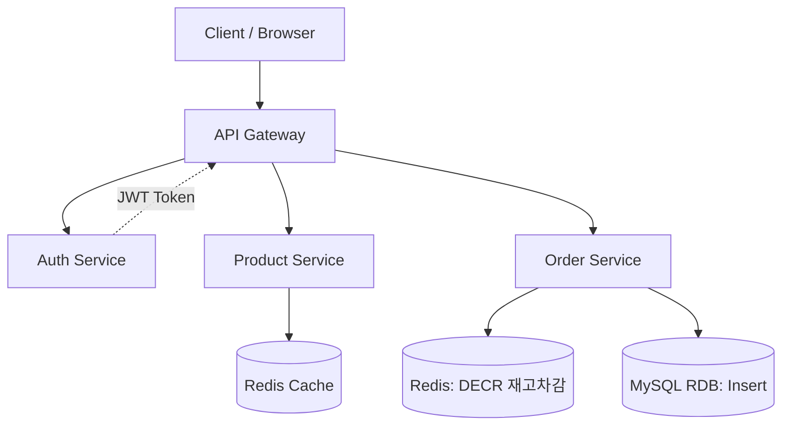
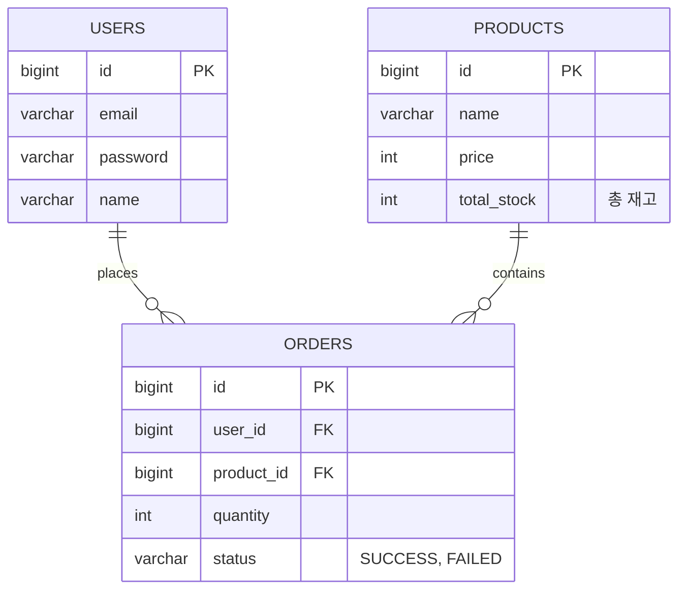

#  DropX — 대규모 선착순 한정판 주문 시스템 (High-Concurrency Order System)

> **5,000 VU 트래픽 폭증 상황에서도 데이터 정합성을 보장하는 Kubernetes 기반 GitOps 주문 인프라**

---

##  1. 프로젝트 개요 (Overview)

DropX는 한정판 상품 드롭(Drop) 시 발생하는 **Spike Traffic(순간 트래픽 폭증)** 상황을 해결하기 위해 설계되었습니다.  
애플리케이션의 단순 기능을 넘어, **대규모 트래픽을 견디는 인프라 복원력**과 **데이터 정합성 확보**를 목표로 합니다.

- **핵심 목표:** 동시 접속자 5,000명 대응 및 재고 음수 발생 방지  
- **중점 기술:** Kubernetes(HPA), Redis(Atomic Operation), GitOps(ArgoCD), Observability

---
## 2. Work Stack Why? (DropX 프로젝트)

> 이 페이지는 DropX 프로젝트에서 선택한 기술 스택과 각 기술의 선택 이유, 내 환경에서의 장점 및 활용 전략을 상세히 설명합니다.

---

### 1. Kubernetes (Bare-metal)

- **선택 이유**
  - MSA 기반 분산 애플리케이션 운영에 최적화된 컨테이너 오케스트레이션 도구
  - Pod 단위 리소스 격리, ReplicaSet 기반 확장, Self-Healing 제공
  - 온프레미스 환경에서도 클러스터 단위 고가용성 설계 가능

- **내 환경에서의 장점**
  - VM 3대 구성 (Master 1, Worker 2) 로 로컬 클러스터 운영 가능
  - HPA를 통한 실시간 스케일링 실습 가능
  - CronJob/Job 활용한 백엔드 배치 테스트 가능

- **활용 전략**
  - Backend/Frontend/Worker 서비스 분리 및 배포
  - StatefulSet으로 DB/Redis 영속성 확보
  - 네트워크 정책과 리소스 제한 적용으로 실무 환경과 유사하게 운영

---

### 2. MetalLB + Nginx Ingress Controller

- **선택 이유**
  - Bare-metal 환경에서 LoadBalancer 기능 제공
  - Ingress Controller로 외부 트래픽 라우팅 및 TLS Termination 가능

- **내 환경에서의 장점**
  - 외부 IP 없이 VM 환경에서 LoadBalancer 테스트 가능
  - API Gateway와 Frontend 트래픽 라우팅 구현 가능
  - Ingress 기반 TLS/Domain 시뮬레이션 가능

- **활용 전략**
  - MetalLB로 External IP 할당
  - Nginx Ingress Controller로 HTTP/HTTPS 트래픽 라우팅
  - 서비스별 도메인 네임 기반 라우팅 정책 설정

---

### 3. GitLab CI + ArgoCD (GitOps)

- **선택 이유**
  - GitOps 패턴: Git이 Source of Truth
  - CI/CD 자동화: 코드 → 이미지 → 배포 → 클러스터 적용
  - ArgoCD를 통한 선언적 배포, 롤백, Sync History 제공

- **내 환경에서의 장점**
  - GitLab Runner로 Docker 이미지 빌드/Push 자동화
  - Helm Chart 기반 배포 자동화
  - ArgoCD로 클러스터 상태와 Git 상태를 동기화

- **활용 전략**
  - CI: 소스코드 변경 → 이미지 빌드 → Registry Push
  - CD: GitOps repo Update → ArgoCD Auto Sync → K8s Rollout
  - Canary/Blue-Green 배포 및 Rollback 실습 가능

---

### 4. Helm Chart

- **선택 이유**
  - Kubernetes 리소스 템플릿화, 환경별 Overlay 관리 용이
  - 반복적인 배포, 패치, 버전 관리를 쉽게 구현 가능

- **내 환경에서의 장점**
  - dev/prod 환경별 values 파일 관리 가능
  - DropX 서비스(Backend/Frontend/Worker/DB) Helm Chart로 배포 효율화
  - GitOps repo에 Chart 버전 관리 및 자동 Sync 연계

- **활용 전략**
  - Base + Overlay 구조로 환경별 커스터마이징
  - DB Secret, NetworkPolicy, ResourceLimit 값을 Values로 분리
  - 이미지 태그 commit SHA 기반 배포

---

### 5. MySQL (StatefulSet) + Redis (Atomic Stock Control)

- **MySQL 선택 이유**
  - RDBMS 특화 서비스로 주문 데이터 영속성 보장
  - StatefulSet과 PVC 조합으로 장애 시 데이터 보존 가능

- **Redis 선택 이유**
  - 초저지연 재고 선차감 처리
  - Lua Script로 원자적 DECR 구현 → 동시성/재고 정합성 보장

- **내 환경에서의 장점**
  - DB Pod 삭제/복구 시 PVC 활용한 Self-Healing 검증 가능
  - Redis 기반 Worker Job 테스트 → 초저지연 처리 경험 제공

- **활용 전략**
  - Backend 주문 API: Redis DECR → 성공 시 MySQL Insert
  - StatefulSet으로 DB/Redis Pod 재배치 가능
  - PersistentVolume Claim 활용 데이터 유지

---

### 6. Observability Stack (Prometheus + Grafana + Alertmanager + Loki)

- **선택 이유**
  - Prometheus: Metrics 수집 및 HPA 연동
  - Grafana: 대시보드 시각화
  - Alertmanager: Slack 등 알람 전송
  - Loki + Promtail: 로그 수집 및 분석

- **내 환경에서의 장점**
  - 노드/Pod 상태 모니터링
  - Web/Backend/Worker 각각의 성능 지표 수집 가능
  - 장애 시 알람 → 롤백 시나리오 실습 가능

- **활용 전략**
  - Node Exporter, K8s Metrics, Application Metrics 수집
  - RPS, Error Rate, Pod Restart 지표 대시보드화
  - Slack 알람과 연계해 Incident 대응 과정 문서화

---

### 7. k6 (Load Testing)

- **선택 이유**
  - Spike Traffic 시 동시 접속 및 TPS/응답 시간 검증 가능
  - CI/CD 파이프라인에서 자동 부하 테스트 통합 가능

- **내 환경에서의 장점**
  - 로컬 VM 환경에서 부하 시뮬레이션 가능
  - HPA, ReplicaSet, ResourceLimit 테스트에 유용

- **활용 전략**
  - Backend / API Gateway 대상 시나리오 작성
  - TPS 2,000+, Latency < 200ms 목표 검증
  - Load Test 결과 Grafana와 연계

---

### 8. 개발 언어 및 프레임워크

| Component       | Language/Framework | 선택 이유 |
|-----------------|-----------------|-----------|
| Backend API     | Python FastAPI   | Async 처리 가능, Lightweight, MSA API 구현 용이 |
| Frontend        | React            | SPA 기반 UI, 시세 차트 표현 최적화 |
| Worker Job      | Python Script    | CronJob/Job 실행, Redis DECR 연동 용이 |
| Infrastructure  | Bash / YAML      | Helm/K8s 리소스 관리, CI/CD 파이프라인 스크립팅 |

---

### 9. 결론

- DropX 프로젝트는 **“실무형 GitOps 기반 MSA 운영 플랫폼”** 경험을 목표로 설계
- 단순 애플리케이션 배포가 아니라, **운영/확장/관측/장애 대응까지** 포함
- 각 기술은 **내 환경(VM 3대, 온프레 K8s)에서 실습 가능**, 면접 포트폴리오로 증빙 가능

---

##  3. System Architecture

###  3.1 Infra Architecture (인프라 구조도)

#### 핵심 설계 디테일

1. **Traffic Entry**  
   - `k6` 기반 5,000 VU 부하 테스트 수행  
   - `MetalLB` + `Nginx Ingress`로 외부 트래픽 수용  

2. **Auto Scaling**  
   - 모든 마이크로서비스(`Auth`, `Product`, `Order`)에 **HPA 적용**  
   - 부하 증가 시 파드 자동 확장  

3. **Data Integrity**  
   - 고부하 `Order Service`에 **Redis Atomic 연산(DECR)** 적용  
   - DB 병목 방지 및 재고 정합성 확보  

4. **GitOps CD**  
   - `GitLab CI` → `ArgoCD` 연동  
   - 코드 푸시부터 클러스터 반영까지 자동 Sync  

5. **Observability**  
   - `Prometheus` 메트릭 수집  
   - 장애 발생 시 `Slack` 실시간 알림  

---

###  3.2 Application Architecture (서비스 구조도)

---

##  4. 화면 구성 및 API (Interface)

###  화면 흐름 (UI Flow)
* **로그인:** JWT 기반 사용자 인증 및 보안 세션 유지
* **상품 목록/상세:** Redis 캐싱을 통한 빠른 정보 조회 및 실시간 재고 확인
* **주문/결제:** 구매 클릭 시 Redis 기반 대기열 및 재고 검증 로직 진입

###  주요 API 명세
| 서비스 | 엔드포인트 | 설명 |
| :--- | :--- | :--- |
| **Auth** | `POST /api/v1/auth/login` | 사용자 로그인 및 토큰 발급 |
| **Product** | `GET /api/v1/products/{id}` | 상품 정보 및 현재 재고 조회 |
| **Order** | `POST /api/v1/orders` | **핵심:** Redis 재고 선차감 후 DB 저장 |

---

##  5. 데이터베이스 모델링 (ERD)

---
