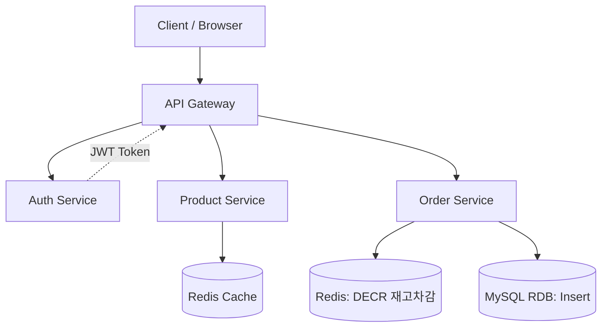

# 🛒 DropX — 대규모 선착순 한정판 주문 시스템 (High-Concurrency Order System)

> **5,000 VU 트래픽 폭증 상황에서도 데이터 정합성을 보장하는 Kubernetes 기반 GitOps 주문 인프라**

---

## 📌 1. 프로젝트 개요 (Overview)

DropX는 한정판 상품 드롭(Drop) 시 발생하는 **Spike Traffic(순간 트래픽 폭증)** 상황을 해결하기 위해 설계되었습니다.  
애플리케이션의 단순 기능을 넘어, **대규모 트래픽을 견디는 인프라 복원력**과 **데이터 정합성 확보**를 목표로 합니다.

- **핵심 목표:** 동시 접속자 5,000명 대응 및 재고 음수 발생 방지  
- **중점 기술:** Kubernetes(HPA), Redis(Atomic Operation), GitOps(ArgoCD), Observability

---

## 🏗️ 2. System Architecture

### 🌐 2.1 Infra Architecture (인프라 구조도)

#### 🔑 핵심 설계 디테일

1. **Traffic Entry**  
   - `k6` 기반 5,000 VU 부하 테스트 수행  
   - `MetalLB` + `Nginx Ingress`로 외부 트래픽 수용  

2. **Auto Scaling**  
   - 모든 마이크로서비스(`Auth`, `Product`, `Order`)에 **HPA 적용**  
   - 부하 증가 시 파드 자동 확장  

3. **Data Integrity**  
   - 고부하 `Order Service`에 **Redis Atomic 연산(DECR)** 적용  
   - DB 병목 방지 및 재고 정합성 확보  

4. **GitOps CD**  
   - `GitLab CI` → `ArgoCD` 연동  
   - 코드 푸시부터 클러스터 반영까지 자동 Sync  

5. **Observability**  
   - `Prometheus` 메트릭 수집  
   - 장애 발생 시 `Slack` 실시간 알림  

---

### 🏗️ 2.2 Application Architecture (서비스 구조도)

---

## 📱 3. 화면 구성 및 API (Interface)💻 화면 흐름 (UI Flow)로그인: JWT 기반 사용자 인증 및 보안 세션 유지상품 목록/상세: Redis 캐싱을 통한 빠른 정보 조회 및 실시간 재고 확인주문/결제: 구매 클릭 시 Redis 기반 대기열 및 재고 검증 로직 진입⚙️ 주요 API 명세서비스엔드포인트설명AuthPOST /api/v1/auth/login사용자 로그인 및 토큰 발급ProductGET /api/v1/products/{id}상품 정보 및 현재 재고 조회OrderPOST /api/v1/orders핵심: Redis 재고 선차감 후 DB 저장🗄️ 4. 데이터베이스 모델링 (ERD)코드 스니펫erDiagram
    USERS {
        bigint id PK
        varchar email
        varchar password
        varchar name
    }
    PRODUCTS {
        bigint id PK
        varchar name
        int price
        int total_stock "총 재고"
    }
    ORDERS {
        bigint id PK
        bigint user_id FK
        bigint product_id FK
        int quantity
        varchar status "SUCCESS, FAILED"
    }
    
    USERS ||--o{ ORDERS : "places"
    PRODUCTS ||--o{ ORDERS : "contains"
🧪 5. 검증 시나리오 (Test Scenarios)[ ] ArgoCD GitOps 동기화: 소스 코드 변경 시 클러스터 배포 자동화 확인[ ] HPA 확장 테스트: k6 부하 발생 시 파드(Pod) 개수가 자동으로 늘어나는지 확인[ ] 동시성 제어 테스트: 5,000개 요청 시 정확히 한정된 재고만큼만 주문이 생성되는지 확인[ ] 장애 알림 테스트: 특정 서비스 다운 시 Prometheus 감지 및 Slack 알림 수신 확인
